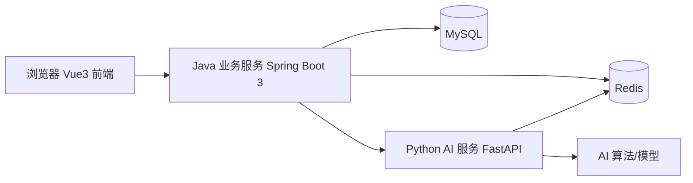

# 部署教程

## 1. 本地开发部署

### 1.1 环境要求

| 依赖 | 版本 |
| --- | --- |
| JDK | 17+（推荐 21 LTS） |
| Maven | 3.9+ |
| Node.js | 20+ |
| pnpm | 推荐 11 |
| Python | 3.11+，或使用 uv |
| MySQL | 8.0 |
| Redis | 7.x，或 Memurai |

### 1.2 数据库

```sql
CREATE DATABASE admin_scaffold
  DEFAULT CHARACTER SET utf8mb4
  COLLATE utf8mb4_unicode_ci;
```

后端通过环境变量连接数据库和 Redis：

```text
DB_HOST=localhost
DB_PORT=3306
DB_NAME=admin_scaffold
DB_USERNAME=root
DB_PASSWORD=your-password
REDIS_HOST=localhost
REDIS_PORT=6379
CALLBACK_BASE_URL=http://127.0.0.1:8080
```

### 1.3 启动三个服务

后端：

```bash
cd backend
mvn spring-boot:run
```

AI 服务：

```bash
cd ai-service
uv sync
uv run uvicorn app.main:app --host 0.0.0.0 --port 8000
```

前端：

```bash
cd frontend
pnpm install
pnpm dev
```

访问 http://localhost:5173 。

## 2. Docker Compose 部署

```bash
cd docker
docker compose up -d --build
```

服务：

| 服务 | 端口 | 说明 |
| --- | --- | --- |
| mysql | 3306 | 业务数据库 |
| redis | 6379 | 缓存与任务状态 |
| backend | 8080 | Java 服务 |
| ai-service | 8000 | Python AI 服务 |
| frontend | 80 | Nginx 托管前端 |

默认数据库密码为 `root123456`，生产环境务必通过环境变量覆盖。

## 3. 生产部署检查项

- MySQL、Redis 必须设置强密码。
- `JWT_SECRET` 必须替换为随机长密钥。
- `CALLBACK_TOKEN` 必须与 `ai_service_config.api_key` 一致。
- Java 与 Python 服务不要直接暴露到公网，前端通过 Nginx 反向代理 `/api`。
- 日志持久化到磁盘或采集系统。
- 数据库变更必须通过 Flyway 脚本执行。

## 4. 一键脚本

开发环境可使用：

```powershell
scripts/start-dev.ps1
scripts/stop-dev.ps1
```

冒烟验证：

```powershell
scripts/smoke.ps1
```

## 5. 架构图



