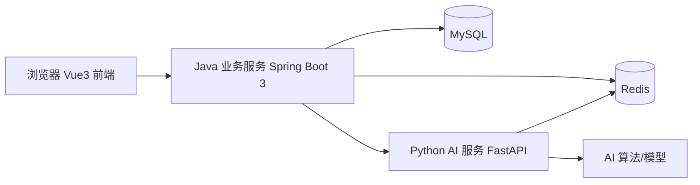

# 前后端双端管理脚手架项目开发计划书（细化版）

> 版本：v2.0  
> 适用读者：项目负责人、Java 开发、前端开发、Python AI 服务开发、测试、部署运维  
> 定位：本版在原计划书基础上补充可直接落地的技术基线、目录结构、数据模型、接口契约、任务状态机、开发任务拆解与验收标准。

---

## 0. 修订说明与重要澄清

本版不是推翻原计划，而是在原计划基础上做“可执行化”补全。主要修订如下：

1. 将原文中的“ArtDesignPro”统一修订为“Ant Design Pro”。该名称通常指蚂蚁集团的 Ant Design Pro 后台设计规范；在 Vue 技术栈中，建议使用 **Ant Design Vue 4.x** 实现同类的企业级布局与交互，而不是直接引入 React 版组件。
2. 补充明确的技术版本基线，避免开发时各自使用不兼容版本。
3. 补充 monorepo 目录结构、数据库表结构、接口清单、AI 任务状态机，解决程序员“不知道从哪写起”的问题。
4. 将原有阶段计划拆成带验收标准的具体任务，并给出依赖关系。
5. 新增测试方案、部署方案、风险清单和“待确认决策”，方便负责人拍板。

### 0.1 待确认决策

以下决策直接影响技术选型和任务拆解，建议项目负责人在开工前确认；本文给出默认建议：

| 决策项 | 默认建议 | 影响 |
| --- | --- | --- |
| 前端是否使用 TypeScript | 使用 TypeScript | 类型更严谨，但学习成本略高；若不使用，目录结构仍按 TS 预留 |
| AI 异步任务实现方式 | 一期使用 FastAPI 异步任务 + Redis 状态；任务耗时较长或并发较大时升级 Celery | 影响 Python 服务内部实现 |
| 数据库版本管理 | 引入 Flyway 管理 DDL | 保证多人开发环境一致 |
| 部署方式 | 开发期本地运行，交付期提供 Docker Compose | 影响交付物范围 |
| 一期演示 AI 能力 | 文本摘要/关键词抽取 | 作为联调样例，验证完整链路 |

---

## 1. 项目目标与范围

### 1.1 项目目标

交付一套可运行的“Java 传统业务 + Python AI 服务”双端管理脚手架，包含：

- 前端：Vue3 企业级后台管理界面，支持登录、动态菜单、角色权限、系统管理、AI 任务展示。
- Java 后端：用户、角色、菜单、权限、日志、缓存、AI 任务调度等基础能力。
- Python 服务：FastAPI 独立服务，提供健康检查、通用 AI 接口、异步任务与结果回调。
- 文档：开发说明、接口文档、数据库设计、部署教程、论文/答辩支撑材料。

### 1.2 一期范围

- 单仓库 monorepo，包含 `frontend`、`backend`、`ai-service`、`docs` 四个主要目录。
- 单用户体系：一个管理端，不包含多租户。
- AI 能力以“可替换的示例算法”形式交付，不绑定具体大模型。
- 支持本地部署和 Docker Compose 部署。

### 1.3 一期非目标

- 不引入注册中心、网关、分布式事务等微服务组件。
- 不做大模型训练、微调或私有化模型集群。
- 不做移动端 App。
- 不实现复杂工作流引擎；如需工作流，应在二期单独设计。

---

## 2. 技术选型与版本基线

> 原则：所有依赖锁定到具体大版本，README 中给出最小可用版本。Java 后端与前端版本不互相干扰。

### 2.1 前端

| 分类 | 技术 | 推荐版本 | 说明 |
| --- | --- | --- | --- |
| 运行时 | Node.js | 20 LTS | 低于 18 可能导致 Vite 5 无法运行 |
| 核心框架 | Vue | 3.4+ | Composition API + `<script setup>` |
| 构建工具 | Vite | 5.x | 开发服务器、生产构建 |
| 语言 | TypeScript | 5.x | 建议使用 |
| 路由 | Vue Router | 4.x | 动态路由、路由守卫 |
| 状态管理 | Pinia | 2.x | 用户信息、权限、主题、布局状态 |
| UI | Ant Design Vue | 4.x | 组件库 |
| 图表 | ECharts | 5.x | 首页看板 |
| HTTP | Axios | 1.x | 封装双后端请求 |
| 代码规范 | ESLint + Prettier | 当前稳定版 | 统一格式化 |

### 2.2 Java 后端

| 分类 | 技术 | 推荐版本 | 说明 |
| --- | --- | --- | --- |
| JDK | Java | 17 LTS 或 21 LTS | 必须满足 Spring Boot 3 要求 |
| 框架 | Spring Boot | 3.2.x 或 3.3.x | 3.0 以下不兼容 |
| 安全 | Spring Security | 6.x | 随 Spring Boot 3 引入 |
| 持久层 | MyBatis-Plus | 3.5.x 稳定版 | 原文写 4.x，实际以 Maven 当前稳定版为准 |
| 数据库 | MySQL | 8.0 | 字符集 `utf8mb4` |
| 缓存 | Redis | 7.x | Token、权限、AI 任务状态 |
| JWT | jjwt | 0.12.x | 生成与校验 Token |
| 接口文档 | Knife4j | 适配 Spring Boot 3 的版本 | 自动生成 OpenAPI 文档 |
| 工具 | Hutool | 5.8.x | 通用工具 |
| 简化代码 | Lombok | 最新稳定版 | 实体/DTO |
| 数据库迁移 | Flyway | 10.x 或当前稳定版 | 管理 DDL 脚本 |
| 构建 | Maven | 3.9+ | 构建与依赖管理 |

### 2.3 Python AI 服务

| 分类 | 技术 | 推荐版本 | 说明 |
| --- | --- | --- | --- |
| 运行时 | Python | 3.11+ | 3.10 也可，但建议 3.11 |
| 服务框架 | FastAPI | 0.110+ | 异步接口 |
| ASGI 服务 | Uvicorn | 0.30+ | 生产建议配合 Gunicorn |
| 数据校验 | Pydantic | 2.x | 请求/响应模型 |
| HTTP 客户端 | httpx | 0.27+ | 调用 Java 回调接口，异步友好 |
| Redis | redis-py | 5.x | 任务状态与队列 |
| 数据处理 | NumPy / Pandas | 当前稳定版 | 示例算法依赖 |
| 模型扩展 | PyTorch / Transformers | 按需 | 默认不打包大模型，提供扩展点 |
| 任务队列 | Celery | 5.x | 二期或长任务场景启用 |
| 测试 | pytest | 8.x | 接口与任务测试 |
| 代码规范 | Ruff | 当前稳定版 | 检查与格式化 |

### 2.4 环境与工具

- 开发工具：IntelliJ IDEA、VS Code、Navicat、Redis Desktop Manager。
- 版本控制：Git + Gitee/GitHub。
- 接口调试：Postman / Apifox。
- 数据库管理：Flyway 负责版本化，Navicat 只用于查看和手工调试。

---

## 3. 总体架构设计

### 3.1 架构分层



### 3.2 常规业务请求链路

1. 前端调用 Java 服务接口，携带 `Authorization: Bearer <accessToken>`。
2. Java 服务通过 Spring Security 校验 Token，并从 Redis 读取权限缓存。
3. 业务逻辑操作 MySQL，必要时读写 Redis 缓存。
4. 返回统一响应结构 `{ code, message, data, requestId }`。

### 3.3 AI 异步任务请求链路

1. 前端提交 AI 任务，例如“对文本 X 进行摘要分析”。
2. Java 服务创建 `ai_task` 记录，状态为 `PENDING`，生成全局唯一 `taskNo`。
3. Java 服务调用 Python 服务创建任务接口。
4. Python 服务接收任务，写 Redis 状态，进入异步执行。
5. 任务完成后，Python 服务回调 Java 服务的 `POST /api/ai/callback/task`。
6. Java 服务更新任务状态，保存结果，前端轮询 `GET /api/ai/tasks/{id}` 获取结果。

### 3.4 模块边界

| 模块 | 职责 | 禁止做的事 |
| --- | --- | --- |
| Vue 前端 | 页面渲染、交互、状态管理 | 不直接操作数据库，不直接执行业务规则 |
| Java 后端 | 认证授权、业务 CRUD、AI 任务编排、数据落地 | 不实现复杂算法推理 |
| Python 服务 | AI 推理、数据处理、算法调度 | 不写系统管理业务逻辑 |
| MySQL | 业务数据持久化 | 不承担队列职责 |
| Redis | 缓存、Token、任务状态 | 不保存核心业务全量数据 |

---

## 4. 代码仓库与目录结构

建议使用单仓库：

```text
admin-scaffold/
├── frontend/
│   ├── src/
│   │   ├── api/                 # 按模块拆分的接口定义
│   │   ├── assets/
│   │   ├── components/          # 通用组件，如 ProTable、ProSearchForm
│   │   ├── layout/              # 企业级布局
│   │   ├── router/              # 静态路由 + 动态路由组装
│   │   ├── stores/              # Pinia：user、permission、app
│   │   ├── types/               # TS 类型
│   │   ├── utils/               # request、auth、format
│   │   └── views/               # 页面
│   ├── package.json
│   ├── vite.config.ts
│   └── .env.development
├── backend/
│   ├── src/main/java/com/example/admin/
│   │   ├── common/              # 统一响应、异常、常量、工具
│   │   ├── config/              # Redis、MyBatis、Knife4j、跨域
│   │   ├── security/            # JWT、认证过滤器、权限注解
│   │   ├── module/
│   │   │   ├── auth/            # 登录、刷新、退出
│   │   │   ├── system/          # 用户、角色、菜单、日志
│   │   │   └── ai/              # AI 配置、任务、回调
│   │   └── AdminApplication.java
│   ├── src/main/resources/
│   │   ├── application.yml
│   │   ├── application-dev.yml
│   │   ├── application-prod.yml
│   │   └── db/migration/        # Flyway SQL 脚本
│   └── pom.xml
├── ai-service/
│   ├── app/
│   │   ├── api/                 # 路由与请求处理
│   │   ├── core/                # 配置、安全、日志
│   │   ├── schemas/             # Pydantic 模型
│   │   ├── services/            # AI 算法服务
│   │   └── tasks/               # 异步任务管理器
│   ├── tests/
│   ├── pyproject.toml
│   └── .env.example
├── docs/
│   ├── api/
│   ├── database/
│   └── deploy/
├── docker/
│   └── docker-compose.yml
└── README.md
```

---

## 5. 数据库设计

> 一期共 10 张核心表。字段类型以 MySQL 8.0 为准；最终以 Flyway 脚本为唯一事实来源。

### 5.1 用户、角色、菜单

**sys_user**

| 字段 | 类型 | 说明 |
| --- | --- | --- |
| id | bigint | 主键 |
| username | varchar(50) | 登录名，唯一 |
| password | varchar(100) | BCrypt 加密后的密码 |
| nickname | varchar(50) | 显示名称 |
| avatar | varchar(255) | 头像 URL |
| email | varchar(100) | 邮箱 |
| phone | varchar(20) | 手机号 |
| status | tinyint | 1 启用，0 禁用 |
| last_login_time | datetime | 最近登录时间 |
| created_by | bigint | 创建人 |
| created_at | datetime | 创建时间 |
| updated_at | datetime | 更新时间 |
| deleted | tinyint | 逻辑删除 |

**sys_role**

| 字段 | 类型 | 说明 |
| --- | --- | --- |
| id | bigint | 主键 |
| code | varchar(50) | 角色编码，如 `admin` |
| name | varchar(50) | 角色名称 |
| description | varchar(255) | 描述 |
| status | tinyint | 1 启用，0 禁用 |
| sort | int | 排序 |
| created_at / updated_at / deleted | - | 审计字段 |

**sys_menu**

| 字段 | 类型 | 说明 |
| --- | --- | --- |
| id | bigint | 主键 |
| parent_id | bigint | 父菜单，根为 0 |
| name | varchar(50) | 菜单名称 |
| type | varchar(20) | `dir` 目录、`menu` 菜单、`button` 按钮 |
| path | varchar(200) | 前端路由路径 |
| component | varchar(200) | 前端组件路径 |
| perm | varchar(100) | 权限标识，如 `system:user:add` |
| icon | varchar(100) | 图标名 |
| sort | int | 排序 |
| visible | tinyint | 是否显示 |
| status | tinyint | 状态 |

**sys_user_role**：`user_id`、`role_id`，联合唯一。  
**sys_role_menu**：`role_id`、`menu_id`，联合唯一。

### 5.2 日志

**sys_login_log**

| 字段 | 类型 | 说明 |
| --- | --- | --- |
| id | bigint | 主键 |
| username | varchar(50) | 登录账号 |
| ip | varchar(64) | 来源 IP |
| user_agent | varchar(255) | 浏览器信息 |
| status | tinyint | 1 成功，0 失败 |
| message | varchar(255) | 结果说明 |
| login_time | datetime | 登录时间 |

**sys_oper_log**

| 字段 | 类型 | 说明 |
| --- | --- | --- |
| id | bigint | 主键 |
| user_id | bigint | 操作人 |
| module | varchar(50) | 模块 |
| action | varchar(50) | 操作类型 |
| method | varchar(200) | 请求方法 |
| request_url | varchar(255) | 请求地址 |
| request_method | varchar(10) | GET/POST/PUT/DELETE |
| params | text | 请求参数 |
| result | text | 返回结果摘要 |
| status | tinyint | 成功/失败 |
| error_msg | varchar(1000) | 异常信息 |
| ip | varchar(64) | IP |
| duration_ms | bigint | 耗时 |
| oper_time | datetime | 操作时间 |

### 5.3 AI 任务

**ai_service_config**

| 字段 | 类型 | 说明 |
| --- | --- | --- |
| id | bigint | 主键 |
| code | varchar(50) | 服务编码，唯一 |
| name | varchar(100) | 服务名称 |
| base_url | varchar(255) | Python 服务地址 |
| api_key | varchar(255) | 加密后的调用密钥 |
| timeout_seconds | int | 超时时间 |
| enabled | tinyint | 是否启用 |

**ai_task**

| 字段 | 类型 | 说明 |
| --- | --- | --- |
| id | bigint | 主键 |
| task_no | varchar(64) | 全局唯一任务编号 |
| biz_type | varchar(50) | 业务类型，如 `text_summary` |
| biz_id | bigint | 关联业务 ID，可空 |
| service_code | varchar(50) | 对应 AI 服务编码 |
| status | varchar(20) | `PENDING/QUEUED/RUNNING/SUCCEEDED/FAILED/CANCELLED` |
| params_json | json | 任务入参 |
| error_msg | varchar(1000) | 失败原因 |
| retry_count | int | 已重试次数 |
| max_retry | int | 最大重试次数，默认 3 |
| timeout_seconds | int | 超时时间 |
| callback_url | varchar(255) | 回调地址 |
| created_by | bigint | 创建人 |
| created_at / updated_at | datetime | 审计字段 |

**ai_task_result**

| 字段 | 类型 | 说明 |
| --- | --- | --- |
| id | bigint | 主键 |
| task_id | bigint | 任务 ID |
| result_type | varchar(50) | 结果类型 |
| result_json | json | 结果数据 |
| raw_data | longtext | 原始返回，可空 |
| duration_ms | bigint | 执行耗时 |
| created_at | datetime | 创建时间 |

### 5.4 索引与约束建议

- `sys_user.username` 唯一索引。
- `sys_role.code` 唯一索引。
- `sys_menu.parent_id` 普通索引。
- `ai_task.task_no` 唯一索引。
- `ai_task.status` 普通索引，用于任务扫描。
- `sys_login_log.login_time` 普通索引，用于日志查询。
- 用户、角色、菜单、日志统一使用逻辑删除字段。

---

## 6. 接口契约规范

### 6.1 统一响应结构

```json
{
  "code": 0,
  "message": "success",
  "data": {},
  "requestId": "uuid"
}
```

约定：

- `code=0` 表示成功。
- 业务异常使用明确业务码，例如 `1001` 参数错误、`1002` 数据不存在、`401` 未登录、`403` 无权限。
- 所有接口统一返回 HTTP 200，业务结果放在 `code` 中，避免前端对不同 HTTP 状态过度分支。安全例外如 Token 失效可在 HTTP 401 返回，由 Axios 拦截器统一处理。

### 6.2 认证接口

| 方法 | 路径 | 说明 |
| --- | --- | --- |
| POST | `/api/auth/login` | 登录，返回 accessToken、refreshToken、用户信息 |
| POST | `/api/auth/refresh` | 刷新 Token |
| POST | `/api/auth/logout` | 退出，将 Token 加入黑名单 |
| GET | `/api/auth/me` | 当前用户信息 |
| PUT | `/api/auth/password` | 修改密码 |

### 6.3 系统管理接口

| 模块 | 方法 | 路径 |
| --- | --- | --- |
| 用户 | GET/POST/PUT/DELETE | `/api/system/user`、`/api/system/user/{id}` |
| 角色 | GET/POST/PUT/DELETE | `/api/system/role`、`/api/system/role/{id}` |
| 菜单 | GET/POST/PUT/DELETE | `/api/system/menu`、`/api/system/menu/{id}` |
| 角色授权 | PUT | `/api/system/role/{id}/menus` |
| 用户状态 | PUT | `/api/system/user/{id}/status` |
| 登录日志 | GET | `/api/monitor/login-log` |
| 操作日志 | GET | `/api/monitor/oper-log` |
| 在线用户 | GET/DELETE | `/api/monitor/online`、`/api/monitor/online/{tokenId}` |
| 缓存 | DELETE | `/api/monitor/cache/{key}` |

### 6.4 AI 管理接口

| 方法 | 路径 | 说明 |
| --- | --- | --- |
| GET | `/api/ai/config` | 查看 AI 服务配置 |
| PUT | `/api/ai/config/{id}` | 修改 AI 服务配置 |
| POST | `/api/ai/tasks` | 创建 AI 任务 |
| GET | `/api/ai/tasks` | 分页查询任务 |
| GET | `/api/ai/tasks/{id}` | 查询任务及结果 |
| DELETE | `/api/ai/tasks/{id}` | 取消任务 |
| POST | `/api/ai/callback/task` | Python 服务回调，仅内部调用 |

### 6.5 Python 服务内部接口

| 方法 | 路径 | 说明 |
| --- | --- | --- |
| GET | `/health` | 健康检查 |
| GET | `/api/v1/ping` | Java 服务连通性探测 |
| POST | `/api/v1/tasks` | 创建 AI 推理任务 |
| GET | `/api/v1/tasks/{task_id}` | 查询任务状态 |
| POST | `/api/v1/tasks/{task_id}/retry` | 手动重试 |

`POST /api/v1/tasks` 请求示例：

```json
{
  "task_no": "AI202608080001",
  "biz_type": "text_summary",
  "params": {
    "content": "需要分析的文本内容",
    "max_length": 200
  },
  "callback_url": "http://backend:8080/api/ai/callback/task"
}
```

### 6.6 回调安全

Java 服务需要校验 Python 回调来源：

1. 请求头携带 `X-Ai-Service-Token`。
2. 与 `ai_service_config.api_key` 配置比对。
3. 校验 `task_no` 存在，且状态允许回调。
4. 回调结果只允许将 `RUNNING -> SUCCEEDED/FAILED`，重复回调幂等处理。

---

## 7. AI 任务状态机

```text
PENDING -> QUEUED -> RUNNING -> SUCCEEDED
                     RUNNING -> FAILED -> QUEUED（重试）
                     RUNNING -> CANCELLED
```

规则：

- Java 创建任务后状态为 `PENDING`，提交 Python 成功后置为 `QUEUED`。
- Python 开始执行后状态为 `RUNNING`。
- 成功后回调 `SUCCEEDED`，同时保存 `ai_task_result`。
- 失败后按 `max_retry` 重试；重试次数用尽后置为 `FAILED`。
- 超时由 Java 或 Python 侧任务扫描器检测，超时任务自动重试或失败。
- 前端每隔 2 秒轮询一次任务详情，最多轮询到 `SUCCEEDED/FAILED/CANCELLED`。

### 7.1 一期异步方案建议

**方案 A：FastAPI 异步任务 + Redis 状态（推荐一期）**

- Python 服务用 `asyncio.create_task` 或 `BackgroundTasks` 执行。
- 任务状态写入 Redis：`ai:task:{task_no}`。
- 适用于几秒到几分钟的推理任务，代码简单，便于教学。

**方案 B：Celery + Redis（升级方案）**

- 长耗时、高并发、需要定时重试时启用。
- Worker 独立进程，Java 侧契约不变。
- 需要额外部署 worker，文档中需说明。

---

## 8. 权限模型

### 8.1 RBAC 模型

采用“用户 - 角色 - 菜单/权限”四级模型：

- 用户：登录主体。
- 角色：权限集合，一个用户可有多个角色。
- 菜单：目录、菜单、按钮三级。
- 权限标识：按钮级 `perm`，如 `system:user:add`。

### 8.2 Token 与登录流程

1. 登录成功后签发 `accessToken`（建议 2 小时）和 `refreshToken`（建议 7 天）。
2. Token 使用 JWT 保存用户 ID、角色编码；敏感信息不放入 Token。
3. Java 服务将 Token 的 `jti` 写入 Redis，用于黑名单和在线用户管理。
4. 前端 Axios 请求拦截器自动携带 Token；响应 401 时尝试刷新，刷新失败跳转登录页。
5. 权限校验使用 Spring Security 的注解，如 `@PreAuthorize("hasAuthority('system:user:add')")`。

### 8.3 动态路由

1. 登录后调用 `GET /api/auth/me`，返回用户信息、角色、菜单树。
2. 前端按菜单树组装动态路由，存入 Pinia。
3. 路由守卫在刷新页面时重新加载权限数据。
4. 按钮权限使用自定义指令 `v-permission="'system:user:add'"` 或组件级判断。

---

## 9. 前端开发细化

### 9.1 布局

- 采用“左侧菜单 + 顶部区域 + 内容区”的经典后台布局。
- 支持侧边栏折叠、多标签页、面包屑。
- 主题使用 CSS 变量或 Ant Design Vue 的 ConfigProvider，提供浅色/暗黑两套主题。

### 9.2 路由与页面清单

| 模块 | 页面 | 说明 |
| --- | --- | --- |
| 登录 | `/login` | 登录页 |
| 首页 | `/dashboard` | 数据看板 |
| 用户 | `/system/user` | 用户管理 |
| 角色 | `/system/role` | 角色管理 |
| 菜单 | `/system/menu` | 菜单权限管理 |
| 日志 | `/monitor/login-log`、`/monitor/oper-log` | 日志查询 |
| 在线用户 | `/monitor/online` | 在线用户管理 |
| AI 任务 | `/ai/task` | AI 任务列表 |
| AI 结果 | `/ai/task/:id` | 任务详情与结果展示 |
| AI 配置 | `/ai/config` | 服务配置 |
| 个人中心 | `/profile` | 个人资料、修改密码 |

### 9.3 Axios 封装

- 支持 `VITE_API_BASE_URL` 指向 Java 服务。
- 预留 `VITE_AI_BASE_URL` 或统一由 Java 转发，避免前端直连 Python 服务。
- 拦截器统一处理 Token、刷新、错误提示、请求 ID。
- 封装 `get/post/put/delete`，泛型返回 `Result<T>`。

### 9.4 通用组件

- `ProTable`：表格、分页、排序、筛选。
- `ProSearchForm`：搜索表单。
- `ModalForm`：弹窗表单。
- `StatusTag`：任务/状态标签。
- `FileUpload`：文件上传。
- `IconPicker`：菜单图标选择。

---

## 10. Java 后端开发细化

### 10.1 统一基础能力

- 统一响应：`Result<T>`。
- 全局异常：`GlobalExceptionHandler`，区分业务异常、参数异常、系统异常。
- 请求日志：AOP 记录操作日志，异步写入。
- 限流：基于 Redis 的简单计数器或接口注解。
- 跨域：开发环境允许本地前端地址，生产环境配置白名单。

### 10.2 模块开发顺序

1. `common`：常量、结果对象、异常、工具类。
2. `security`：JWT 工具、认证过滤器、权限注解。
3. `system`：用户、角色、菜单、日志。
4. `monitor`：在线用户、缓存管理。
5. `ai`：服务配置、任务管理、Python 客户端、回调。

### 10.3 Python 客户端建议

- 使用 `RestTemplate` 或 `WebClient` 封装 Python 接口。
- 支持连接超时、读取超时、重试。
- Python 服务不可用时，Java 返回明确错误：`AI 服务不可用`。
- 配置文件区分开发、测试、生产地址。

### 10.4 缓存 Key 规范

| 场景 | Key 示例 | 过期时间 |
| --- | --- | --- |
| 登录 Token | `login:token:{jti}` | 与 Token 有效期一致 |
| 用户权限 | `auth:perms:{userId}` | 30 分钟 |
| 用户信息 | `sys:user:{id}` | 30 分钟 |
| AI 任务状态 | `ai:task:{taskNo}` | 1 天 |

---

## 11. Python AI 服务开发细化

### 11.1 启动与配置

```text
uvicorn app.main:app --host 0.0.0.0 --port 8000 --reload
```

环境变量：

| 变量 | 说明 |
| --- | --- |
| `APP_NAME` | 服务名称 |
| `REDIS_URL` | Redis 连接地址 |
| `CALLBACK_TOKEN` | 回调 Java 服务使用的密钥 |
| `DEFAULT_TIMEOUT_SECONDS` | 默认任务超时 |

### 11.2 示例 AI 能力

一期提供两个示例，验证完整链路：

- `text_summary`：文本摘要。
- `keyword_extract`：关键词抽取。

开发者扩展新能力时：

1. 在 `app/services/` 中新增算法类。
2. 在 `app/schemas/` 中新增入参/出参模型。
3. 在 `biz_type` 注册表中注册类型。
4. Java 侧无需修改核心代码，只需配置新的 `biz_type`。

### 11.3 任务管理器职责

- 接收任务时校验参数。
- 写入 Redis 状态 `QUEUED`。
- 异步执行算法。
- 执行成功写入结果并回调 Java。
- 执行失败记录错误，按策略重试。
- 提供任务状态查询接口。

---

## 12. 开发计划与任务拆解

> 计划总工期约 27 个工作日。适合 1 名 Java、1 名前端、1 名 Python 并行开发；若为单人完成，按顺序执行。

### 12.1 阶段总览

| 阶段 | 名称 | 工期 | 主要产出 |
| --- | --- | --- | --- |
| P0 | 项目准备 | 1 天 | 仓库、环境、规范、数据库初版 |
| P1 | Java 后端脚手架 | 7 天 | 权限、日志、缓存、AI 调度 |
| P2 | 前端脚手架 | 7 天 | 布局、动态路由、系统页面、AI 页面 |
| P3 | Python AI 服务 | 5 天 | FastAPI 服务、异步任务、示例算法 |
| P4 | 联调与修复 | 3 天 | 全链路可用、缺陷修复 |
| P5 | 文档与交付 | 2 天 | 文档、部署脚本、演示 |

### 12.2 P0 项目准备

| 任务 | 验收标准 |
| --- | --- |
| 创建 Git 仓库和分支规则 | main/dev/feature 分支存在，README 可运行 |
| 初始化 `frontend`、`backend`、`ai-service` | 三个项目均能本地启动 |
| 编写 Flyway 初始 DDL | 新环境执行后得到完整表结构 |
| 编写 `.env.example` 和配置模板 | 新成员按文档可启动 |

### 12.3 P1 Java 后端脚手架

| 任务 | 验收标准 |
| --- | --- |
| 统一响应、异常、日志 | 所有接口返回统一结构，异常可读 |
| JWT 登录、刷新、退出 | Postman 可完成登录并访问受保护接口 |
| 用户/角色/菜单 CRUD | 页面可调用接口完成基本操作 |
| 角色授权与权限校验 | 无权限用户返回 403 |
| 登录日志、操作日志 | 关键操作自动记录 |
| Redis 缓存与在线用户 | 可查询在线用户并踢出 |
| AI 服务配置与任务表 | 可维护 Python 服务地址和密钥 |
| Java 调 Python 客户端 | 健康检查、创建任务接口可联调 |

### 12.4 P2 前端脚手架

| 任务 | 验收标准 |
| --- | --- |
| Vite + Vue3 + Ant Design Vue 初始化 | 项目可启动，页面可访问 |
| 布局与主题 | 侧边栏、多标签、暗黑模式可切换 |
| 登录与动态路由 | 登录后按角色显示菜单 |
| 用户/角色/菜单页面 | 可完成增删改查和授权 |
| 通用 ProTable/ProSearchForm | 至少 2 个页面复用 |
| 数据看板 | 首页展示真实统计接口数据 |
| AI 任务页面 | 可创建任务、轮询状态、展示结果 |

### 12.5 P3 Python AI 服务

| 任务 | 验收标准 |
| --- | --- |
| FastAPI 项目初始化 | `/health` 可访问 |
| 配置与日志 | 环境变量生效，日志可追踪 |
| 通用任务接口 | 可创建、查询、重试任务 |
| Redis 状态同步 | 状态变化正确写入 Redis |
| 示例算法 | 文本摘要、关键词抽取返回正确结果 |
| 回调 Java | 成功后 Java 任务表更新为成功 |
| 异常重试 | 模拟失败可看到重试记录 |

### 12.6 P4 联调与修复

| 任务 | 验收标准 |
| --- | --- |
| 完整登录到权限页面流程 | 无刷新丢失权限问题 |
| AI 任务全链路 | 前端创建任务到结果展示可跑通 |
| 异常场景 | Token 过期、AI 服务挂掉、参数错误均有明确提示 |
| 浏览器兼容 | Chrome、Edge 正常显示 |

### 12.7 P5 文档与交付

| 任务 | 验收标准 |
| --- | --- |
| 接口文档 | 覆盖核心接口，含示例 |
| 数据库设计文档 | 与 Flyway 脚本一致 |
| 部署教程 | 新机器按文档可部署 |
| Docker Compose | 一键启动 Java、Python、MySQL、Redis |
| 论文/答辩材料 | 架构图、功能说明、创新点说明齐全 |

---

## 13. 开发规范

### 13.1 Git 规范

- 主干分支：`main`。
- 开发分支：`dev`。
- 功能分支：`feature/{module}-{description}`，如 `feature/user-crud`。
- 修复分支：`fix/{description}`。
- Commit 格式：`feat: 添加用户管理`、`fix: 修复 Token 刷新问题`。
- 禁止直接向 `main` 提交，统一通过 Pull Request 合并。

### 13.2 代码规范

- Java：统一使用 Lombok，实体类不加手写 getter/setter；接口返回 DTO，不直接暴露实体。
- 前端：使用 ESLint + Prettier；组件名 PascalCase；路由常量集中管理。
- Python：使用 Ruff；类型注解尽量完整；Pydantic 模型是接口校验的唯一来源。
- 所有密码、Token、密钥只放在环境变量或配置中心，禁止提交到 Git。

### 13.3 文档同步

- 接口变更必须同步更新 `docs/api/`。
- 数据库变更必须新增 Flyway 脚本，不允许手工改表。
- 部署变更必须同步更新 `docs/deploy/`。

---

## 14. 测试方案

| 层次 | 内容 | 工具 |
| --- | --- | --- |
| Java 单元测试 | 工具类、Token 校验、服务层关键逻辑 | JUnit 5 |
| Java 集成测试 | 登录、权限、用户 CRUD | Spring Boot Test + H2 或 Testcontainers |
| Python 测试 | Pydantic 校验、示例算法、任务状态流转 | pytest |
| 前端构建检查 | 生产构建通过、无类型错误 | `vue-tsc` + `vite build` |
| 接口冒烟 | 核心接口按文档跑通 | Apifox / Postman |
| 全链路演示 | 登录到 AI 任务结果展示 | 手工验收单 |

验收原则：

- 每个阶段结束必须跑通本阶段验收标准。
- P4 开始前，Java 与 Python 接口必须冻结，之后变更需评审。
- 交付前使用全新环境按部署文档完整跑一遍。

---

## 15. 部署方案

### 15.1 开发环境启动

```text
后端：java -jar admin-backend.jar 或 IDEA 启动
前端：npm install && npm run dev
Python：uvicorn app.main:app --reload
```

### 15.2 Docker Compose

建议服务：

| 服务 | 端口 | 说明 |
| --- | --- | --- |
| mysql | 3306 | 业务数据库 |
| redis | 6379 | 缓存与任务状态 |
| backend | 8080 | Java 服务 |
| ai-service | 8000 | Python 服务 |
| frontend | 80 | Nginx 托管前端静态文件 |

生产部署检查项：

- MySQL、Redis 设置密码。
- Java 与 Python 服务不在公网暴露管理端口。
- AI 回调使用内网地址和 Token 鉴权。
- 日志持久化到磁盘或采集系统。

---

## 16. 风险与应对

| 风险 | 影响 | 应对 |
| --- | --- | --- |
| Spring Security 6 配置 API 与旧教程差异大 | 认证开发时间超预期 | 先写最小登录 Demo，再扩展权限 |
| MyBatis-Plus 版本与 Spring Boot 3 不兼容 | 启动失败 | 在 P0 锁定版本并验证 |
| Python 依赖版本冲突 | AI 服务启动失败 | 使用 `pyproject.toml` 锁定依赖 |
| 大模型依赖体积过大 | 交付包过大 | 一期不打包大模型，预留接口 |
| 异步任务状态不一致 | 任务丢失或重复 | 任务号幂等、回调幂等、状态机校验 |
| 前端权限刷新丢失 | 页面刷新后菜单消失 | 路由守卫中重新加载权限 |
| 数据库手工改表导致环境不一致 | 联调失败 | 强制使用 Flyway |
| 文档与代码不一致 | 新成员无法上手 | 接口/数据库变更强制同步文档 |

---

## 17. 对原计划的重点建议

### P0：必须调整

1. **修正“ArtDesignPro”为“Ant Design Pro”**，并明确 Vue 侧使用 Ant Design Vue 4.x，避免程序员误以为可以直接用 React 组件。
2. **锁定版本基线**。原计划只写“SpringBoot3、Vue3”，开发时容易出现版本踩坑；本版第 2 章给出基线。
3. **补齐数据库 DDL 和接口契约**。这是程序员最需要的第一份材料，原计划缺失。
4. **明确 AI 异步任务实现方式**。原计划提到 Redis 队列，但没有说清任务状态、重试、回调规则；本版第 7 章给出方案。

### P1：强烈建议

5. **采用 monorepo 单仓库**，降低双端联调时“三份代码三个仓库”的维护成本。
6. **前端使用 TypeScript**，对企业级脚手架更合适，也能提升论文中“工程化”的展示点。
7. **引入 Flyway 管理数据库脚本**，多人协作时不会出现“我本地能跑、你本地不能跑”。
8. **增加测试与验收标准**，每个阶段都有明确“完成”定义，而不是只看时间。

### P2：后续增强

9. 二期可引入 Celery 处理长时间 AI 任务。
10. 二期可加入消息通知、定时任务、文件存储等模块。
11. 如果面向企业部署，建议增加 Prometheus 监控、容器日志采集和 CI/CD 流水线。

---

## 18. 建议的下一步动作

1. 负责人确认第 0.1 节中的默认决策。
2. 按 P0 创建 monorepo 和 Flyway 初始脚本。
3. 按 P1/P3 并行开发 Java 与 Python 服务，先打通“健康检查 + 创建任务 + 回调”。
4. 再进入 P2 前端开发，前端可直接对接真实接口。
5. 最后按 P4/P5 联调、修复、补文档。

